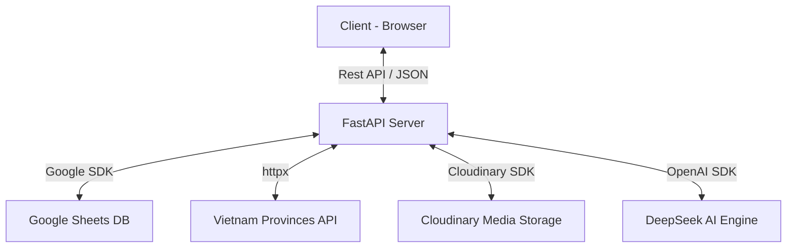

# Architecture & Backend Design - SpentCMS 2.0

SpentCMS 2.0 (SheetFlow) là một hệ thống CMS linh hoạt sử dụng Google Sheets làm cơ sở dữ liệu (Database-as-a-Service). Tài liệu này chi tiết hóa cấu trúc kỹ thuật Back-end phục vụ việc tham khảo và mở rộng.

## 🏗️ Tổng quan Kỹ thuật (Technical Architecture)

### 🛠️ Tech Stack
- **Framework**: FastAPI (Asynchronous Python)
- **Database**: Google Sheets API v4
- **Media Hosting**: Cloudinary (Secure URL delivery)
- **Networking**: httpx (Async HTTP client)
- **AI Integration**: OpenAI SDK (DeepSeek-V3/R1 logic)

## 🧱 Các Module Backend Trọng yếu

### 1. Smart Sheets Service (`sheets_service.py`)
Mọi thao tác dữ liệu được trừu tượng hóa qua lớp Service này:
- **Dynamic Header Mapping**: Tự động nhận diện cấu trúc cột của từng sheet. Người dùng thêm cột trong GSheet, CMS tự động cập nhật form.
- **Adaptive Range Selection**: Chỉ truy xuất vùng dữ liệu chứa thông tin (A1:Z100) để tối ưu độ trễ.
- **Self-Healing logic**: Tự động sửa lỗi lệch cột bằng cách đối chiếu header name trước mỗi thao tác Ghi (Update/Add).

### 2. ID Auto-Generator System
Xử lý logic cấp mã định danh dựa trên loại sản phẩm:
- **Loopback Scan**: Quét ngược từ cuối sheet để tìm ID lớn nhất.
- **Conditional Formatting**: 
    - `Dropbuy`: ID số thuần (6 chữ số).
    - `Non-Dropbuy`: ID tiền tố `N` (Ví dụ: `N42`).

### 3. Proxy & Integration Endpoints

#### 📍 Administration Proxy (`/api/provinces`, `/api/districts`, `/api/wards`)
- Giải quyết vấn đề **CORS** và **Data Stability**.
- Backend đóng vai trò trung gian gọi đến `provinces.open-api.vn`.
- Cấu hình `follow_redirects=True` để xử lý các thay đổi hạ tầng từ API nguồn.

#### 📁 Media Gateway (`/upload`)
- Thay thế lưu trữ Base64 lỗi thời.
- Nhận file từ `python-multipart`, đẩy trực tiếp lên Cloudinary.
- Trả về `secure_url` (HTTPS) để hiển thị tức thì trên Web bán hàng.

## 📡 Danh sách API chi tiết

| Endpoint | Method | Chức năng | Payload/Params |
| :--- | :--- | :--- | :--- |
| `/api/sheets` | GET | Lấy danh sách danh mục & cấu trúc | Metadata |
| `/id-gen/{type}/{name}` | GET | Tính toán ID tiếp theo | type: dropbuy/non-dropbuy |
| `/api/defaults` | GET | Lấy cấu hình mặc định (Zalo, NV) | - |
| `/api/provinces` | GET | Danh sách 63 Tỉnh/Thành | Redirect follow |
| `/upload` | POST | Upload hình ảnh đơn/nhiều | File (Multipart) |

## 💾 Chiến lược Lưu trữ Dữ liệu (Storage Strategy)

Để duy trì cấu trúc Google Sheets đơn giản nhưng vẫn đáp ứng tính năng cao cấp:
- **Multiple Images**: Lưu trữ dưới dạng chuỗi phân cách bởi `|` (Ví dụ: `url1|url2|url3`). 
- **Backward Compatibility**: Hệ thống tự động nhận diện nếu ô chỉ chứa 1 URL (Single image) hoặc chuỗi pipe (Multiple images) để render đúng UI.
