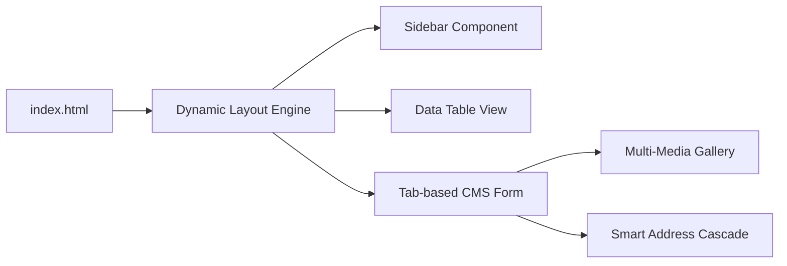

# Frontend Experience & Interface Design - SpentCMS 2.0

SpentCMS 2.0 tập trung vào trải nghiệm người dùng (UX) tối giản nhưng mạnh mẽ, với khả năng thích ứng linh hoạt theo cấu trúc dữ liệu từ Google Sheets.

## 🏗️ Kiến trúc Giao diện (UI Architecture)

Hệ thống được xây dựng trên mô hình **Single Page Application (SPA)** thuần túy, không phụ thuộc vào các framework nặng nề, đảm bảo tốc độ tải trang cực nhanh.

## 🎨 Hệ thống Thiết kế (Design System)

### 1. Nguyên lý Visual Hierarchy
- **Layered Design**: Sử dụng hệ thống đổ bóng (layered shadows) và bo góc lớn (16px - 24px) để tạo chiều sâu cho các Card.
- **Glassmorphism**: Hiệu ứng kính mờ (backdrop-filter) áp dụng cho Sidebar và Modals, tạo cảm giác sang trọng và hiện đại.
- **Micro-interactions**: Các hiệu ứng hover, transition 0.25s mượt mà trên mọi nút bấm và trường nhập liệu.

### 2. Hệ quản trị Màu sắc (Adaptive Colors)
Sử dụng **CSS Variables** toàn cục để dễ dàng thay đổi theme:
- `--primary`: Màu chủ đạo (Indigo/Primary).
- `--bg-main`: Màu nền thích ứng Light/Dark mode.
- `--card-bg`: Màu nền thẻ, tối ưu độ tương phản.
- **Red Badges**: Badge "Bắt buộc" thay thế dấu `*` truyền thống, giúp người dùng nhận diện nhanh các trường thông tin quan trọng.

## ⚙️ Engine Xử lý Form Động (Dynamic Form Engine)

Đây là "trái tim" của hệ thống, cho phép tự động sinh giao diện từ header Google Sheets:

### 1. Phân loại Trường dữ liệu thông minh
Hệ thống sử dụng Regex và Mapping để tự động hiển thị đúng UI Component:
- **Media**: Tự động nhận diện `link ảnh` -> Render Gallery.
- **Address**: Nhận diện `tỉnh/tp`, `quận/huyện` -> Render Cascading Dropdowns.
- **AI Fields**: Nhận diện `slogan`, `slug` -> Render nút "AI MAGIC".
- **Contact**: `Link Zalo`, `Link NV` -> Tự động điền (Auto-fill) giá trị mặc định.

### 2. Media Gallery (v30.0)
- **Gallery Grid Layout**: Hiển thị ảnh theo dạng lưới trực quan.
- **Individual Control**: Mỗi ảnh có nút xóa riêng, quản lý trực tiếp trạng thái trước khi lưu.
- **Pipe-logic**: Tự động serialize danh sách ảnh thành chuỗi `|` để tối ưu hóa lưu trữ trong 1 ô GSheet.

### 3. Smart Address Logic (v29.0)
Hệ thống sử dụng logic tầng (Cascading):
- **Tỉnh/TP** (Input) -> Trigger Load **Quận/Huyện**.
- **Quận/Huyện** (Input) -> Trigger Load **Phường/Xã**.
- Dữ liệu được lấy trực tiếp từ Backend Proxy để đảm bảo tính sẵn sàng cao (High Availability).

## 🚀 Chiến lược Hiệu suất (Performance)

- **Lazy Rendering**: Chỉ render nội dung tab khi người dùng chuyển tab.
- **Deferred Uploads**: Ảnh được giữ ở bộ nhớ đệm (Object URL) và chỉ upload lên Cloudinary khi người dùng nhấn "Lưu", giúp tiết kiệm băng thông và tài nguyên server.
- **No Reflow Scrolling**: Cố định cột thao tác (Action Column) giúp người dùng quản lý dữ liệu dễ dàng trên các bảng có hàng chục cột.
